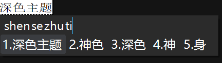
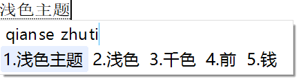
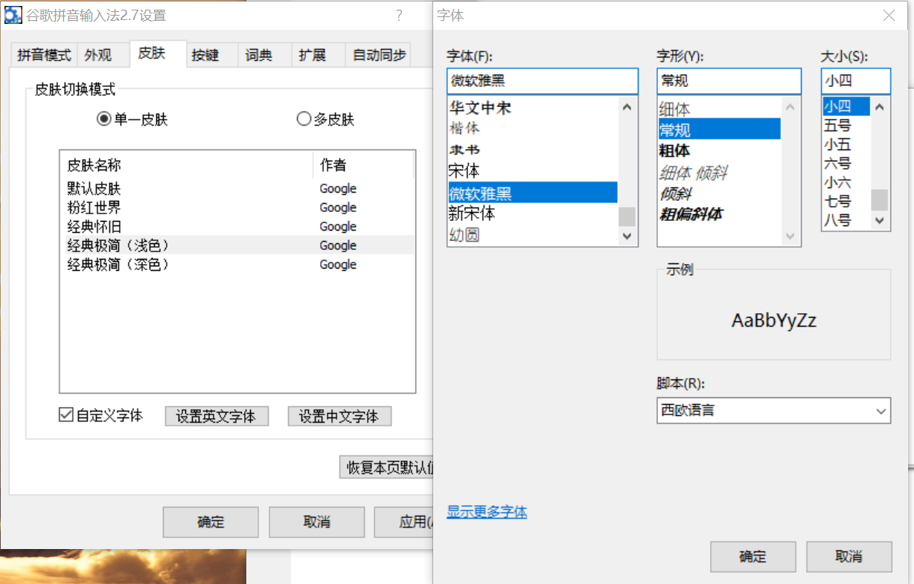

# 谷歌拼音输入法 Windows 版本精简皮肤

#### 皮肤截图

#### 使用方法

将下载的 `.gskin` 文件复制到 `C:\Program Files (x86)\Google\Google Pinyin 2\data\Google\Google Pinyin 2\Skins`

若重复复制，需要在下面目录删除副本

`C:\Program Files (x86)\Google\Google Pinyin 2\user\你的用户名\Google\Google Pinyin 2\Skins`

#### 建议设置字体

* 英文：Segoe UI 小四
* 中文：微软雅黑 小四

